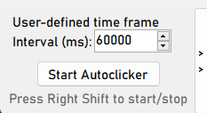
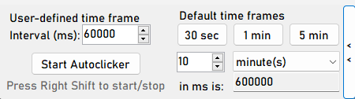

# Autoclicker



Eine Autoclicker Anwendung für Desktops, die ich entwickelt habe mit einen [Tutorial](https://youtu.be/tKDNFzJgcrU?si=wvqpE6fMYh2w_hp7).



Dieses Tutorial wurde mit benutzer- und vordefinierte Zeiten erweitert. Die benutzerdefinierten Zeiten muss man in Millisekunden angeben. Als Hilfe dafür gibt es einen Konverter, welches Minuten und Sekunden zu Millisekunden umrechnet.
Es gibt drei vordefinierte Zeiten, die zur Auswahl bereitgestellt sind. Nach der Auswahl wird sich der Clicker daran anpassen und diese Zeit zum klicken verwenden.

---

## 🛠️ Technologien

- **Sprache:** C#
- **Framework:** .NET 4.7.2 (oder höher)
- **Entwicklungsumgebung:** Visual Studio

---

## 🚀 Funktionen

- Benutzerdefinierte Zeitangabe
- Drei Vordefinierte Zeiten zur Auswahl
- Autoclicker, der sich an die ausgewählte Zeit anpasst
- Millisekunden-Rechner als Hilfe für die benutzerdefinierte Zeitangabe

---

## 🔧 Installation & Ausführung

### Schritte

1. Repository klonen:
   ```bash
   git clone https://github.com/PPahl04/Autoclicker.git
   cd Autoclicker

2. Anwendung starten
    ```bash
    dotnet build
    AutoClicker\bin\Debug\AutoClicker.exe